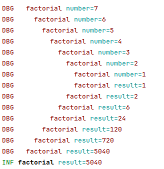

# console-slog

[](https://pkg.go.dev/github.com/phsym/console-slog) [](https://raw.githubusercontent.com/phsym/console-slog/master/LICENSE) [](https://github.com/phsym/slog-console/actions/workflows/go.yml) [](https://codecov.io/gh/phsym/console-slog) [](https://goreportcard.com/report/github.com/phsym/console-slog)

A handler for slog that prints colorized logs, similar to zerolog's console writer output without sacrificing performances.

## Installation
```bash
go get github.com/phsym/console-slog@latest
```

## Example
```go
package main

import (
	"errors"
	"log/slog"
	"os"

	"github.com/phsym/console-slog"
)

func main() {
	logger := slog.New(
		console.NewHandler(os.Stderr, &console.HandlerOptions{Level: slog.LevelDebug}),
	)
	slog.SetDefault(logger)
	slog.Info("Hello world!", "foo", "bar")
	slog.Debug("Debug message")
	slog.Warn("Warning message")
	slog.Error("Error message", "err", errors.New("the error"))

	logger = logger.With("foo", "bar").
		WithGroup("the-group").
		With("bar", "baz")

	logger.Info("group info", "attr", "value")
}
```


When setting `console.HandlerOptions.AddSource` to `true`:
```go
console.NewHandler(os.Stderr, &console.HandlerOptions{Level: slog.LevelDebug, AddSource: true})
```


## Performances
See [benchmark file](./bench_test.go) for details.

The handler itself performs quite well compared to std-lib's handlers. It does no allocation:
```
goos: linux
goarch: amd64
pkg: github.com/phsym/console-slog
cpu: Intel(R) Core(TM) i5-6300U CPU @ 2.40GHz
BenchmarkHandlers/dummy-4               128931026            8.732 ns/op               0 B/op          0 allocs/op
BenchmarkHandlers/console-4               849837              1294 ns/op               0 B/op          0 allocs/op
BenchmarkHandlers/std-text-4              542583              2097 ns/op               4 B/op          2 allocs/op
BenchmarkHandlers/std-json-4              583784              1911 ns/op             120 B/op          3 allocs/op
```

However, the go 1.21.0 `slog.Logger` adds some overhead:
```
goos: linux
goarch: amd64
pkg: github.com/phsym/console-slog
cpu: Intel(R) Core(TM) i5-6300U CPU @ 2.40GHz
BenchmarkLoggers/dummy-4                 1239873             893.2 ns/op             128 B/op          1 allocs/op
BenchmarkLoggers/console-4                483354              2338 ns/op             128 B/op          1 allocs/op
BenchmarkLoggers/std-text-4               368828              3141 ns/op             132 B/op          3 allocs/op
BenchmarkLoggers/std-json-4               393322              2909 ns/op             248 B/op          4 allocs/op
```

## Indentation
`console.Handler` also implements the custom interface:
```go
type Indenter interface {
    // SetIndentation configures the prefix and indent strings.
    // The prefix, if any, is added first,
    // then the indent string is added as many times as the current depth.
    SetIndentation(prefix, indent string)
    
    // Increment the indentation depth.
    Increment()
    
    // Decrement the indentation depth.
    // If the current depth is already zero there is no change.
    Decrement()
}
```
Indentation of functions can occasionally be useful for delineating
calls by indenting callees more than callers.

This isn't something that `log.slog` provides.
It is necessary to provide the handler pointer as a global variable or function
in order to use the `Indenter` interface.

Because the current `depth` is stored within the `console.Handler` this functionality is not thread-safe.
In order to use it in a multi-thread environment there must be a handler (and logger) for each thread,
and these items must be passed down through all intervening function calls (in lieu of thread variables).

### Example

```go
package main

import (
	"log/slog"
	"os"

	"github.com/phsym/console-slog"
)

var hdlr *console.Handler

func main() {
	hdlr = console.NewHandler(os.Stderr, &console.HandlerOptions{Level: slog.LevelDebug})
	hdlr.SetIndentation("", "  ")
	slog.SetDefault(slog.New(hdlr))
	slog.Info("factorial", "result", factorial(7))
}

func factorial(number uint) uint {
	hdlr.Increment()
	defer hdlr.Decrement()

	slog.Debug("factorial", "number", number)
	var result uint
	if number < 2 {
		result = 1
	} else {
		result = number * factorial(number-1)
	}
	slog.Debug("factorial", "result", result)
	return result
}
```



The specific case of runaway recursion shows up clearly as the messages
march repeatedly across the screen.